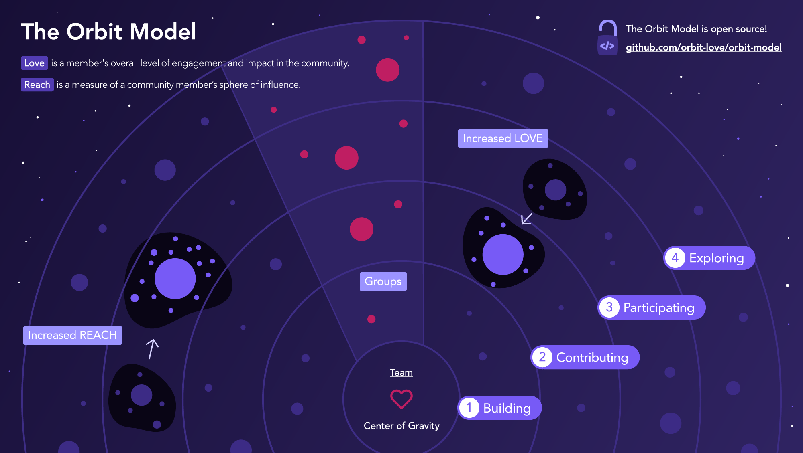
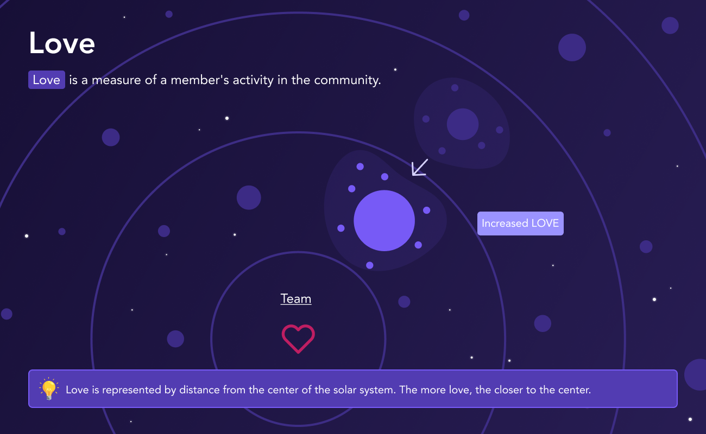
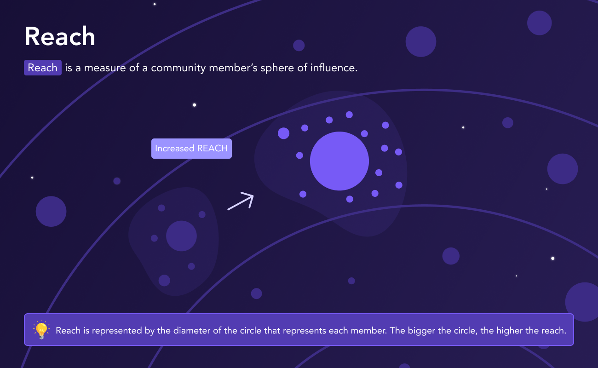
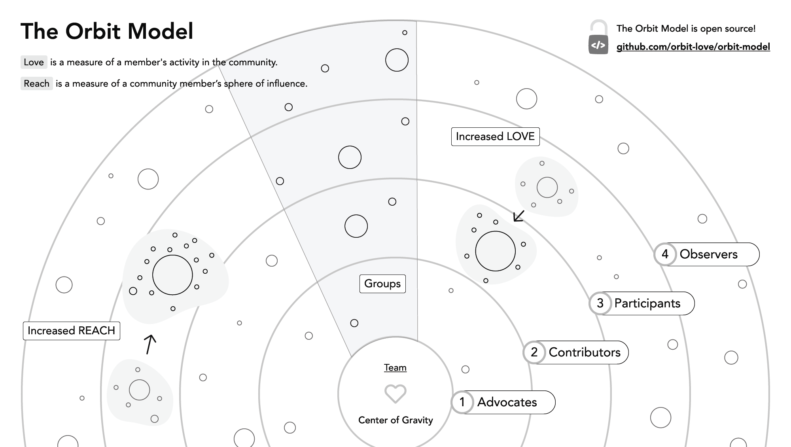

# 欢迎来到“轨道模型”的世界

“轨道模型”是一个构建高“引力”社区的框架体系。一个高引力社区意味着社区通过提供一份极致体验以吸引和留存社区成员。

轨道模型包含四项基本概念： 引力， 热情， 影响力，及轨道层级：

- **热情 (Love)** 是用于描述社区成员投入到社区的参与程度和活跃程度。
- **影响力 (Reach)** 是用于描述社区成员影响（力）范围的一种度量指标。
- **引力 (Gravity)** 是一种描述社区吸引力的指标，可以用于社区成员的留存和新成员的吸纳。
- **轨道层级 (Orbit Levels)** 是用来为成员进行分层并对不同层级的成员设计不同服务项目的实用工具。

**轨道模型的目标是用于提升社区的引力。**

> “轨道模型” 是由Orbit的团队创立和维护，Orbit是一个社区管理平台。[可以从以下地址获取更多信息和参与早期体验](https://orbit.love/).


👇 请继续阅读，以获知如何使用“轨道模型”

# 内容大纲

- [简介](#简介)
  - [热情](#热情)
  - [影响力](#影响力)
  - [引力](#引力)
- [轨道层级](#轨道层级)
  - [第4层轨道 - 观望者](#轨道-4---观望者)
  - [第3层轨道 - 参与者](#轨道-3---参与者)
  - [第2层轨道 - 贡献者](#轨道-2---贡献者)
  - [第1层轨道 - 布道者](#轨道-1---布道者)
  - [第0层轨道 - 社区核心团队](#轨道-0---社区核心团队)
- [使用轨道层级](#使用轨道层级)
  - [确定层级](#确定层级)
  - [按照层级划分的活动](#按照层级划分的活动)
  - [如何晋升到下一个层级](#如何晋升到下一个层级)
- [关键指标](#轨道模型关键指标)
- [完整案例](#完整案例)
- [其他主题](#其他主题)
  - [群组](#groups)
  - [轨道模型和漏斗模型的对比](#轨道模型和漏斗模型的对比)
- [一些有用的资源](#一些有用的资源)
- [Orbit聊天室图标](#Orbit聊天室图标)
- [轨道模型的打印资源](#轨道模型的打印资源)
- [早期适配计划](#早期适配计划)
- [关于轨道模型](#关于轨道模型)
- [关于贡献](#关于贡献)
- [变更日志](#变更日志)

# 简介

轨道模型是一种帮助组织了解、管理和发展其社区的表达方式和可视化工具。它可以帮助我们解决如下问题：

- 我该如何度量我的社区参与以及社区成长？
- 我该如何吸引新人参与社区？
- 哪些社区成员值得我投入更多时间在他们身上？
- 哪些贡献是我需要引导社区成员来参与的？

谁适合使用轨道模型？

**开发者社区**
了解谁在使用你的软件，以便你可以建立自己的社区。

**开源项目**
跟踪谁在提交issue并创建PR，以便你可以与个人贡献者建立牢固的关系。

**社区驱动的商业**
了解最有影响力的客户是谁，这样你就可以利用他们分享你产品的方式，来扩大你的影响力，以吸引更多客户。

**还有其他专注于发展社区的人...**

### “太阳系”

让我们想象一下太阳系的构成，围绕着它的天体以及同心圆轨道，这套模型非常适合可视化地描述一个社区。将社区成员和围绕着太阳的行星做一下类比，有些成员如同水星火星般紧紧围绕在太阳身边，而有些如天王星海王星一样远离星系中心。有些成员的影响力如木星般辐射周边，而有些成员可能像小行星般追随巨人的脚步。社区中的万事万物如同星系一般不停运转中。

为了便于讨论社区成员之间的不同， 所以我们给他们不同的描述， 轨道模型赋予每一个人两种核心属性： **热情** 和 **影响力**。

**我们的目标就是为每一位社区成员增进他们的热情和影响力**

## 热情

“热情” 是指社区成员参与和投入社区的程度。一个对社区充满热情的成员会在社区十分活跃并承担重要角色，比如参与内容贡献、协调以及组织会议等。

> “詹妮弗参加了最近的5次meetup， 并且在下个月她还要筹办自己的。另外，她还在博客上发文指导大家怎么样在Linux安装软件包。她在社区的热情在今年急速升温， 我们需要在社区showcase上展示她的工作。”

社区成员对他们所参与的每个社区会投入不同程度的“热情”，因此，“热情”的度量方法会随着社区的不同而不同。我可能对自己组织的健跑俱乐部投入极大热情，但我通常对社区业主会议不屑一顾。

**了解社区成员的“热情”可以帮助你决定应为他们提供哪些社区工作机会,** 例如你可以让他承担需要大量时间和经历的社区工作或者只需要几分钟的简单贡献。.

**如果你提供的工作机会与当前成员在社区的参与程度越匹配，他们就越容易接受这份工作安排。**

💡 在轨道模型上，“热情”是通过与太阳系中心的距离来表示的。 你在社区中表现越“热情”，你离社区中心就越近.

<p align="center">
  
</p>

### 如何度量“热情”

在“轨道模型”中，社区成员的“热情”由他们完成的活动的数量，质量和新近程度来推断。 换句话说，对于每个成员，你需要了解他们做了什么贡献，每个贡献的相对重要性以及贡献发生的时间。

首先列出所有对你的社区重要的活动。 例如：

- 参加会议
- 在meetup上发表演讲
- 在Github/Gitee上提交一个PR
- 回答一个论坛上的问题

然后考虑每种活动的相对重要性。 我们建议使用简单的1-3权重等级。

> "组织一次社区meetup需要花费大量时间和精力，因此我们给它分配的活动权重为3。仅参加meetup是1，但发布会议新闻稿可能会是2。"

由于所有活动的默认权重均为1，因此为活动赋予多大的权重完全取决于社区。 一些社区会考虑设计得更复杂一点，而其他社区使用默认权重就可以了。


我们建议从设置权重为1开始，如果需要进行更细粒度的报告和分析，则在活动中增加不同权重。

你可以定义一个活动权重列表，例如:

| 活动                             | 权重 (最大为3) |
| ------------------------------- | ----------------- |
| 参加会议                         | 1                 |
| 在meetup上发表演讲                | 3                 |
| 在Gitee上提交一个PR               | 1                 |
| PR被社区合入                      | 3                 |
| 回答一个论坛上的问题               | 3                 |

定义社区的活动和活动权重列表是使用“轨道模型”要做的第一件事。


> 请记住，应该合理定义权重，因为它们可以有效反映出社区成员在现实中的热情。但_不_应将它们当做儿戏般在图表和指标中随意更改。例如，如果撰写博客文章确实表明某人对社区的热情，那么在“轨道模型”中一定要增加该活动的重要性（提升权重）。

> 另一方面，如果提升“推特/微博参与度”恰好是你所在团队本季度的OKR，则不应提升“转发博文”的权重。

定义好活动和权重后，制作另一个表来记录每个成员的活动。 从上一张表中增加成员的姓名，活动类型，日期和活动权重。

| 成员姓名       | 活动类型             | 日期       | 权重 |
| ----------------- | ------------------------- | ---------- | ----- |
| 张三    | 参加我们的会议   | 2019-11-14 | 1     |
| 李四 | 提交一个PR     | 2019-12-21 | 1     |
| 王五       | 回答一个论坛上的问题 | 2020-01-14 | 3     |
| 王五       | PR被社区合入 | 2020-01-20 | 3     |
| 张三    | 在meetup上发表演讲         | 2020-02-11 | 3     |

有了成员的活动历史记录后，我们可以查看每个活动的权重以及活动发生在多少个月之前，经过计算他们可以呈现“热情”的数值。

`热情值(月度) =  (活动值的总和) * (0.9 ^ 活动距离现在的月数)`

对于那些当月完成的活动, `活动距离现在的月数` = 0.

记录活动发生的时间，可以帮助你计算[活动衰减]值（＃活动衰减）。

可以在你的表格中, 增加数据列 "几个月之前" 和 "热情值" 

在下面这个例子中，假设今天是2020年2月20日，在2月的活动是0个月前，1月的活动是1个月前，依此类推。

| 成员姓名       | 活动类型             | 日期       | 权重| 几个月前 | 热情值 |
| ----------------- | ------------------------- | ---------- | ----- | ---------- | ----- |
| 张三    | 参加活动   | 2019-11-14 | 1     | 3          | 0.729 |
| 李四 | 提交一个PR     | 2019-12-21 | 1     | 2          | 0.81  |
| 王五       | 回答一个论坛上的问题 | 2020-01-14 | 3     | 1          | 2.7   |
| 王五       | PR被社区合入 | 2020-01-20 | 3     | 1          | 2.7   |
| 张三    | 在meetup上发表演讲         | 2020-02-11 | 3     | 0          | 3.0   |


然后，为了计算每个成员的“热情”，我们将每个成员的值相加。

`热情值(成员) = SUM(热情值(月度))`

| 成员姓名            | 热情值      |
| ----------------- | --------- |
| 王五               | 5.4       |
| 张三               | 3.729     |
| 李四              | 0.81      |

最终的“热情”得分考虑了每个成员参与活动的频率，活动新近程度和活动权重。

要查看成员对社区的热情值，只需将所有成员所有活动的热情值汇总即可。

社区成员的热情值随着贡献频率的增加而增加，也会随着贡献的减少和时间的流逝而减少。

### 活动衰减

成员在社区的状态不是一种稳态，而是一种漂泊状态。 随着时间的流逝，如果没有持续的互动和参与，社区的成员就会全都离开。

在轨道模型中，我们称这种趋势为活动衰减。 在“热情”公式中，衰减由系数“（0.9 ^ 活动距离现在的月数）”表示，它确保了最近的活动比过去的活动具有更大的权重，并且“热情”和后面会提到的“轨道层级”将准确地反映出每个成员参加社区的意愿。

随着时间的流逝，社区成员将逐渐从内层轨道走向外层轨道。


## 影响力

影响力是度量社区成员影响他人能力的一种方式，并考虑了他们的声誉，信誉和联系程度。

> “ 艾维是我们社区影响力最高的成员之一。他一直在Twitter上与人们互动，他的博客每月都会有成千上万的访问者。他还是一家受人尊敬的机构的高级工程师。”

与“热情”不同，影响力的计算是独立于特定社区的。 例外情况确实适用于已建立的社区，在这些社区中，仅了解成员在社区内部的影响范围是有用的，但对于希望成长的较小社区而言，通常更重要的是了解成员广义上的影响范围。

我们为什么在乎影响力？ 因为**拥有高影响力的人会吸引其他人加入他们的行列，就像小行星被太阳系捕获一样。**我们在高影响力人中建立起人际关系并对他们的热情进行投资可能会因此获得更大的回报。 虽然每个人都有一定的影响力，但作为轨道模型的创建者，我们的工作之一就是帮助我们的每个成员扩大影响范围。 稍后我们将看到，这样做还有助于增加社区的引力。

💡在“轨道模型”上，影响力由代表每个成员的圆的直径表示。 圆圈越大，影响力越大。

<p align="center">
  
</p>

### 度量影响力

要计算影响力，我们需要查看成员的影响力和声誉范围的举证材料。 没有万全之法，最重要的指标取决于你的目标，但以下是一些常见指标：

- 社交媒体数据，例如关注者和参与度
- Gitee上开源项目的关注者和Star数
- 在CSDN、知乎等社区上的声誉得分
- 公司内的头衔和职位
- 个人网站或博客的排名或估算访问量

与“热情”一样，我们也创建一个表，该表为成员影响力的每个指标打分。

| 影响力指标                      | 得分 |
| ---------------------------------- | ----- |
| 1-2k 推特/微博关注者                     | 1     |
| 2-5k 推特/微博关注者                     | 2     |
| 5+k 推特/微博关注者                      | 3     |
| 拥有活跃的个人博客                   | 1     |
| 拥有获得500个star的开源项目           | 3     |
| 在DEV网站上拥有100个关注者            | 2     |

对于每个成员，我们记录并汇总他们符合的条件的分数。 该表如下所示：

| 成员姓名    | 影响力指标                      | 得分 |
| -------------- | ---------------------------------- | ----- |
| 张三            | 2-5k 推特/微博关注者                      | 2     |
| 张三            | 拥有活跃的个人博客                    | 1     |
| 李四            | 拥有活跃的个人博客                    | 1     |
| 张三            | 拥有获得500个star的开源项目           | 3     |
| 李四            | 在DEV网站上拥有100个关注者            | 2     |

然后，我们可以得出每个成员的总和：

| 成员姓名        | 影响力数值    |
| -------------- | ----------- |
| 张三            | 6           |
| 李四            | 3           |

如果你得出的结果有太多的0分或10分以上的成员，请考虑调整影响力指标及其得分，直到最后得分看起来合适为止。

## 引力

引力指标可以衡量一个社区对人们的吸引力，其作用是留存现有成员并吸引新成员。 潜在的成员进入社区后，能感受到社区的工作为成员创造了价值，他们会好奇自己是否也应该参与其中。

> 自2010年以来，法国企业的初创社区变得越来越引人注目。今天不仅有更多的公司和企业家参与其中，而且众所周知的成功故事使企业更容易吸引全球人才。

社区引力是“热情”和“影响力”的最终目的，在这个例子中，“热情”代表着人们为建立法国生态系统而付出的努力，“影响力”代表着法国公司在全球市场上的知名度和知名度。

**“热情”与“影响力”的结合是轨道模型的核心。只有衡量和增加这两个因素，社区才能推动可持续增长。**

就像优质产品在没有某种形式的营销的情况下仍然难以实现销售一样，如果没有足够的影响力，高人气的社区也可能难以维持其引力。

### 度量引力

“热情”与“影响力”是在个人层面上衡量的，而引力是在群体或社区层面上衡量的。引力也可以针对每个轨道层级进行测量。

**引力应该反映社区中正在发生的事情**

- 当新成员加入社区时，引力会上升
- 当成员参与更多活动时，引力会上升（“热情”增加）
- 当成员使社区曝光率增加时，引力会上升（“影响力”增加）
- 当我们失去成员或成员们的参与度下降时，引力会下降

将这些因素考虑在内的基本公式是：

```
引力 = Sum(热情 * 影响力)
```

**计算引力的最简单方法是总结每个成员的热情与影响力的乘积。**

使用上面的示例，来看看引力的计算方法：

| 成员姓名       | 热情 | 影响力 | 热情 \* 影响力 |
| ----------------- | ---- | ----- | ------------- |
| 张三    | 2    | 6     | 12            |
| 李四      | 6    | 3     | 18            |
| 王五    | 7    | 3     | 21            |
| 赵六    | 4    | 5     | 20            |
| 田七       | 2    | 1     | 2             |
|                   |      |       | ----          |
| **社区引力**       |      |       | 73            |

**影响力乘以（而不是加和）热情，因为增加某个成员的影响力可以增加他们完成的所有活动的影响力.**

为了更细化，你可以引入热情系数和影响力系数，以根据每个社区的需求优化计算。 推动增长的新成立社区可能会分配更高的影响力系数，而重视参与的已建立社区可能会分配更大的热情系数。

你应该每月甚至每周计算引力，以查看社区的发展趋势。 这是一个很好的指南针和晴雨表，可以随着时间的推移进行跟踪，并观察不同社区项目如何对其产生的影响。

# 轨道层级

在大多数社区中，有一些成员充满热情，另一些成员则对社区只谈得上感兴趣，而其他人群则介于两者之间。 在轨道模型中，我们将这些队列称为“轨道层级”。 拥有最高热情成员在最靠近太阳系中心处运行。

**轨道层级是一种实用的工具，可用于对社区进行细分并在每个级别设计不同的计划，并为成员在社区的晋升提供清晰的途径。**轨道级别还提供了有用的词汇表，用于讨论每个成员在社区中扮演的角色。

你可以采用最适合的名称来命名轨道层级，但是轨道模型带有一些标准名称，这些名称通常适用于大多数社区。每个轨道层级都有一个相应的序号，其中1是预留给参与度最高的人员。 随着参与度的降低，序号递增。

## 轨道 4 - 观望者

轨道4称为观望者。 这些人可能看过了我们社区的博客文章，也观看了演讲，在推特/微博上关注了我们或尝试了我们的产品。 他们还不是完全活跃的社区成员，但至少是被动地感兴趣，并成为我们受众的一部分。 他们可能不会在今天就加入你的社区，但可能在将来的某一天加入，因此寻找与他们保持联系的方式显得尤为重要。

内容是与观察者互动的好方法，或者是一些轻量级的活动，这可以让他们在不感到任何压力的情况下学习。

## 轨道 3 - 参与者

轨道3中的人称为参与者。 这些人已经从匝道进入到社区的主航道，并开始留下使用（如果涉及到产品）或参与的跟踪记录。 他们做出了一些轻量级的贡献，例如编写文档，进行翻译或在活动中担任志愿者。

诸如论坛之类的在线社区渠道是与用户互动的好方法，因为它使参与者有机会学习社区的规范和文化，同时开始逐渐做出一些贡献。 同样的，可以与其他成员会面的活动也很不错。

## 轨道 2 - 贡献者

轨道2中的人称为贡献者。 通过在社区花费更多时间，承担更具影响力的角色，这些人已经不仅仅满足于参与社区。 他们可能正在主持论坛，主导社区对话，进行演讲或举办小型活动。 他们是社区中一直出现，且有一定识别度的面孔，他们代表着社区期望的文化和行为。

与参与者或观望者相比，驱动贡献者以及和他们互动需要你有更高的影响力。

他们将更愿意与社区中的杰出人士配对，并期望社区提供更深入的学习或发展经验的活动。 作为贡献者，他们为社区做出了巨大的贡献，为此，他们所获得的认可和机会也应与此相称。

## 轨道 1 - 布道者

轨道 1属于社区的内部圈子，也就是布道者。 这些人对社区充满热情，承担着重要的挑战，并发挥了领导作用。 许多其他成员都知道它们，他们希望布道者们提供指导和帮助。 他们可能领导社区中的一个或多个大团体。

社区与布道者们的关系是亲近的，熟悉的和透明的。他们期望尽早获得产品和参与活动，与团队级别的人员接触以及获得一些针对其个人目标的社区工作机会。

例如，你可以使用你的人际网络来帮助布道者找到新工作，如果他们的拥护者人数众多，你可以赞助或者为他的新闻稿做贡献。

## 轨道 0 - 社区核心团队

对社区负有最终责任的人占据了太阳系的中心，位于轨道0。在产品或技术社区中，这些人和组织拥有社区正在建设的资产。在一个休闲社区里，这些人就是组织者。在开源社区中，这是核心团队。

“轨道0”中的人们负有双重责任，既要参与社区内部的活动，又要对社区外部所有利益相关者进行布道。

# 使用轨道层级

本节介绍如何设置轨道层级并充分利用它们。

## 确定层级

更高的热情应该与轨道层级相关。 充满热情的成员应进入轨道1和2，没那么有热情成员应进入3和4轨道。

为此，我们建议使用步进的方式将成员基于热情分组到“轨道级别”中。我们在Orbit产品中使用以下热情值范围。

| 轨道层级      | 热情值范围   |
| ---------------   | ----------   |
| 1 - 布道师     | ≥ 1.5        |
| 2 - 贡献者  | 1 – 1.5      |
| 3 - 参与者  | .5 – 1       |
| 4 - 观望者     | < .5         |

根据这些范围，得出的级别分布如下所示：

[](https://res.cloudinary.com/dzello/image/upload/v1600473812/orbit/Orbit_Level_Chart.png)

## 按照层级划分的活动

通过按轨道层级组织活动清单，可以轻松地找到向每个成员提供的机会。 这是一个例子：

| Activity                | 对应到轨道层级 |
| ----------------------- | :------------------: |
| 参与会议   |         所有层级          |
| 答复论坛问题    |         所有层级          |
| 发表主题演讲         |       轨道 1        |
| 组织meetup        |       轨道 1        |
| 在meetup上发表演讲       |       轨道 2        |
| 提交一个PR     |       轨道 2        |
| 在论坛发表议题       |       轨道 2        |
| 在论坛分享项目 |       轨道 3        |
| 参加社区活动            |       轨道 3        |
| 获得产品积分 |       轨道 3        |
| 阅读博客文章         |       轨道 4        |
| 订阅新闻 |       轨道 4        |
| 在推特/微博关注我们    |       轨道 4        |


这些活动并非仅限于轨道级别：布道者希望订阅新闻通讯，并在推特/微博上关注我们。 但是，**当我们希望找到一个可以提供给布道者的活动时，我们可以寻找标有“轨道1”的活动，例如发表主题演讲或组织聚会**。

## 如何晋升到下一个层级

当你确定了一个准备好进入下一个轨道级别的社区成员时，这是一个充满欢乐的时刻。 在轨道模型中，我们称这个时刻为晋升。

💡 促销可以是你与成员庆祝的实际时刻，也可以是你在社区数据库中记录下来的时刻。

度量成员的热情将帮助你确定何时该开始向他们提供合适下一个轨道层级参与的活动和应承担的责任。 如果他们完成了这些活动并且似乎准备做更多的事情，你就会知道是时候晋升他们到下一层级了。

# 轨道模型关键指标

下面是使用轨道模型时要衡量的最重要指标的摘要。

| 指标         | 应用于                            | 计算方法                              | 指标的用途                                     |
| -------------- | ------------------------------------- | ---------------------------------------- | ------------------------------------------------ |
| 引力        | 整个社区, 轨道层级, 群组 | Sum(热情 \* 影响力)        | 整体描述社区成员增量和参与度的晴雨表      |
| 层级大小     | 轨道层级 4, 3, 2, 1           | 每个层级成员的数量                | 社区成员的均衡性                    |
| 轨道层级    | 社区成员                                | 由社区核心团队评定，参考成员的热情值        | 描述社区成员应在社区处于的位置           |
| 热情           | 社区成员                                | 成员最近参与的活动评分     | 描述社区可以让成员做出何种贡献 |
| 影响力          | 成员                                | 成员影响力分数的总和     | 描述每个社区成员吸引其他人的能力           |
| 活动分数 | 社区成员                                | 完成活动后分数的汇总 | 描述社区成员的参与度            |

# 完整的案例

[Orbit Model Airtable模板](https://airtable.com/shrOH6UzOdzZICXnJ) 包含示例成员数据，公式和图形，它们向你展示轨道模型的各个部分是如何组合在一起的。

阅读[博客全文](https://orbit.love/blog/introducing-the-orbit-model-airtable-template)，以了解模板的各个部分如何工作并制作自己的副本。

# 其他主题

## 群组

大型社区通常由一组较小的社区组成。 在轨道模型中，这些子社区称为群组。 群组可以围绕人，地方和事物形成。 例如：

- 人 - 有影响力的社区成员组成的群组； 比如：大使
- 地方 - 地理位置群组，例如城市，州或国家/地区
- 事物 - 兴趣群组，依据独特的信仰或观点

与更大社区相比，群组成员可以更轻松地与本组中的人联系。 与特定人员，地点或事物相关联的成员在成为协作者时也更容易。

💡 在轨道模型中，可以将群组可视化为从轨道1延伸到轨道4的三角形扇形切片。 每个小组都有自己的布道者，贡献者，参与者和观望者。

**增强社区引力的技巧：确定活跃或潜在的群组，帮助他们扩大影响力，吸引新成员加入该群体.**

## 轨道模型和漏斗模型的对比

轨道模型和营销领域的漏斗模型之间有什么关系？ 这是一个大家常问的问题，也是一个很好的问题。 出售产品并拥有社区的公司通常应同时采用这两种模型。但是他们主要的区别是什么？

漏斗模型是为公司“获取价值”的模型。关键衡量指标是不同阶段的转化率，最终结果是转化收益。

**轨道模型是为社区创造价值的模型。**我们衡量社区中正在创造多少价值以及由谁来创造价值，以便为社区成员提供正确的激励和机会。

举个例子（以Orbit社区来说），我们的一些社区成员来自游戏行业，因此我们可能会考虑将他们彼此联系起来或创造一个空间让他们谈论 Orbit 和游戏。

再以开发者工具为例，社区工作者可以通过 SDK 对社区成员进行分组，然后进一步邀请最活跃的成员来领导每个特定的 SDK 群组。

这是一个对比表格，总结了一些两个模型间的主要差异：

| 漏斗模型                           | 轨道模型                   |
| -------------------------------- | ----------------------------- |
| 转换                              | 采用                      |
| 获取价值                    | 创造价值                |
| 推动人们消费              | 吸引人们参与                |
| 基于单次购买   | 包含于整个生命周期 |
| 二元，领导及其他人 | 多样化成员，轨道层级    |

漏斗是_推_模型。 营销人员将活动积极地传递到客户收件箱和即时信息中，以使它们对某事采取行动，将其推向渠道的下一阶段。

轨道是 _吸引_ 模型. 目标是使社区尽可能地具有吸引力，以便现有成员通过口碑来传播它，而新成员一旦看到他人正在获得的价值，就会自然而然地加入社区的行列。

### 蛋筒冰淇淋

当公司采用轨道模型时，有一种常见情况。 社区和开发人员关系团队使用轨道模型来促进社区成员的参与和发展，而市场和销售团队继续使用漏斗模型来推动购买和收入。 可以把它想象成一个冰淇淋蛋筒，上面有一个大冰淇淋球，盛放在华夫饼蛋筒之上。 不可避免地，一些冰淇淋融化并沿锥状滴落。 冰淇淋球越大，越能够形成圆锥体。

**当社区成员决定要购买或评估产品时，轨道模型和漏斗模型就碰面了。**

对于诸如技术平台之类的复杂产品，对于开发者、布道者或社区经理来说，在潜在买家和销售团队中的某人之间进行介绍是一种最佳实践。 这样可以确保是一次“温暖”的交接过程，并确保销售团队能够充分了解买方的情况，从而使销售过程更加顺畅。

“交接”听起来很容易，但实际上这是非常重要的工作，对于社区团队来说是必不可少的，因为它有助于增加收入并有助于建立社区业务案例。 因此，DevRel和社区负责人[Mary Thengvall](https://twitter.com/mary_grace)的“ DevRel合格潜在客户”一词在你的词汇表中非常重要。 查阅[DevRelCon伦敦2019的玛丽演讲](https://devrel.net/strategy-and-metrics/dont-create-re-use)，以了解更多信息以及如何使用它。

# 一些有用的资源

- [Orbit Model Airtable template](https://airtable.com/shrOH6UzOdzZICXnJ)
- [Introducing the Orbit Model Airtable Template](https://orbit.love/blog/introducing-the-orbit-model-airtable-template) - Patrick Woods - Orbit Blog
- [Why Orbit is better than funnel for developer relations](https://orbit.love/blog/why-orbit-is-better-than-funnel-for-developer-relations) — Orbit Blog
- [Communities aren't funnels](https://www.youtube.com/watch?v=EDgNuFdVay0) — Josh Dzielak, DevRelCon 2019
- [How we're using Orbit to build Orbit](https://orbit.love/blog/how-we-use-orbit-to-build-orbit/) - Orbit Blog

# Orbit聊天室图标

<p align="left">
  <a href="https://github.com/orbit-love/orbit-model/raw/main/Orbit%20Emoji.zip"></a>
</p>

- [下载图标](https://github.com/orbit-love/orbit-model/raw/main/Orbit%20Emoji.zip)
- [阅读博客](https://orbit.love/blog/download-these-orbit-model-icons-for-your-slack-workspace)

# 轨道模型的打印资源

下载并打印轨道模型图（有彩色和黑白可供选择）

<p align="left">
  <a href="https://github.com/orbit-love/orbit-model/raw/main/Printables.zip"></a>
  <a href="https://github.com/orbit-love/orbit-model/raw/main/Printables.zip"></a>
</p>

- [下载图片](https://github.com/orbit-love/orbit-model/raw/main/Printables.zip)

# 早期适配计划

在你的社区使用轨道模型？ 请告诉我们！将你的名字添加到此列表中，并带有指向你的站点，社区或相关材料的链接。

- [Orbit](https://orbit.love/)
- [SimpleAsWater](https://discord.gg/x2kmUXW)
- [Dappkit](https://dappkit.io?ref=orbit_love_repo)
- [Puma Browser](https://www.pumabrowser.com/) ([Discord](https://discord.gg/4frpm84))
- [Apollo GraphQL](https://www.apollographql.com/docs/)
- [Parabeac-Core](https://github.com/Parabeac/Parabeac-Core)

# 关于轨道模型

轨道模型是由开发人员、布道者们开发的，最初用于与软件开发人员社区合作，但是该模型也适用于大多数其他类型的社区。 该模型于2014年首次使用，并于2019年11月发布在GitHub上，因此任何人都可以使用它并做出贡献。 我们旨在使该模型对开源维护者，开发者、布道者，社区经理，创始人以及对构建社区感兴趣的任何人有用。

轨道模型是由社区管理平台[Orbit](https://orbit.love/)团队创建和维护。 要了解有关Orbit产品的更多信息，请查看最近的[博客文章](https://orbit.love/blog)或访问https://orbit.love/。

# 关于贡献

贡献和问题不仅受到社区欢迎，而且是必不可少的！ 请建立issue来记录有关改进模型的新想法，包括反馈，评论和有关如何使用它的信息。 讨论将使轨道模型变得更好，我们将感谢你 💜

阅读[贡献指南](CONTRIBUTING.md)以了解更多信息。

# 变更日志

**2020年3月16日**

- 创建了关于热情，影响力和引力的章节
- 为每个指标添加了计算和示例表
- 增加了轨道模型核心指标章节
- 增加了有关选择和分配轨道层级的章节

**2019年12月10日**

- 增加了轨道层级
- 改进了简介

**2019年6月11日**

- 创建了仓库
