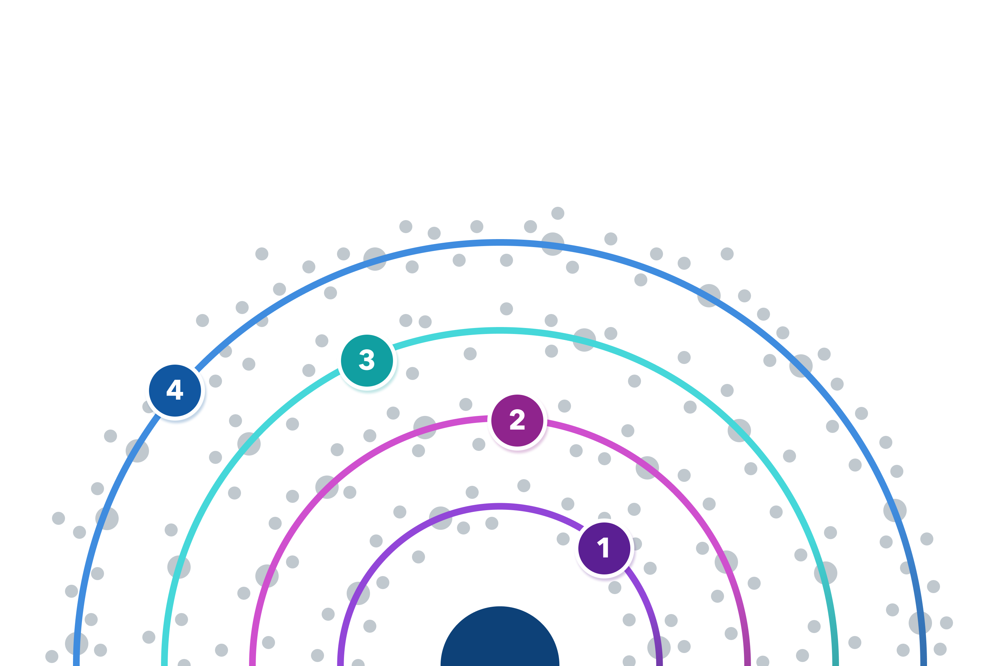

# Orbit Model

The Orbit Model helps developer advocates, evangelists, and community managers build and manage their communities. It's a different way of thinking about customer relationships that emphasizes value created over value captured.

✍️ [Read the blog post](https://orbit.love/blog/why-orbit-is-better-than-funnel-for-developer-relations)

🚧 More coming soon!
