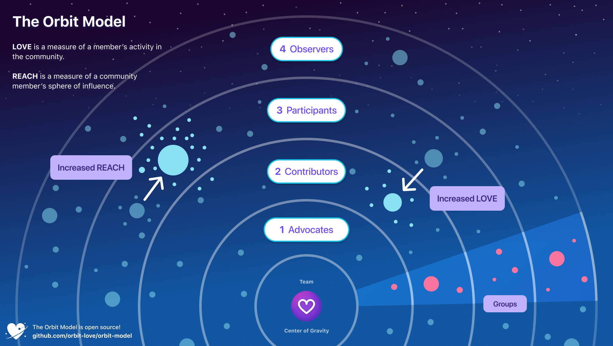
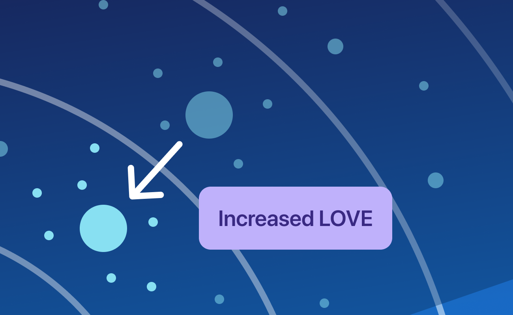
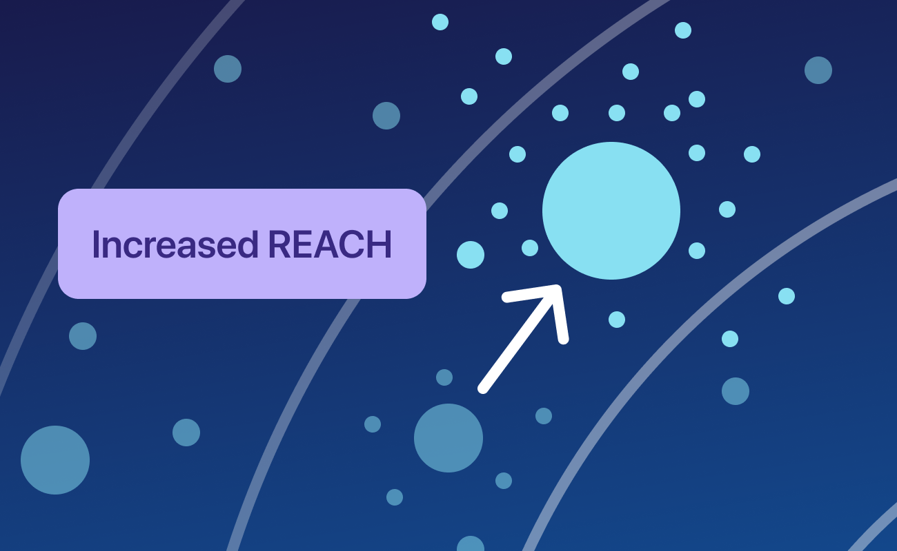

[](https://res.cloudinary.com/dzello/image/upload/v1601328377/orbit/orbit-model-canvas.png)

# Welcome to the Orbit Model

The Orbit Model is a framework for building high gravity communities. A high gravity community is one that excels at attracting and retaining members by providing an outstanding member experience.

The Orbit Model contains four fundamental concepts: Gravity, Love, Reach and Orbit Level:

- **Love** is a member's level of engagement and activity in the community.
- **Reach** is a measure of a community member’s sphere of influence.
- **Gravity** is the attractive force of a community that acts to retain existing members and attract new ones.
- **Orbit levels** are a practical tool for member segmentation and used to design different programs for each level of the community.

**The goal of the Orbit Model is to increase the Gravity of your community.**

> The Orbit Model was created and is maintained by the team at Orbit, the community management platform. [Learn more and sign up for early access](https://orbit.love/).


👇 Keep reading to learn how to get started with the Orbit Model.

# Table of Contents

- [Introduction](#introduction)
  - [Love](#love)
  - [Reach](#reach)
  - [Gravity](#gravity)
- [Orbit levels](#orbit-levels)
  - [Orbit 4 - Observers](#orbit-4---observers)
  - [Orbit 3 - Participants](#orbit-3---participants)
  - [Orbit 2 - Contributors](#orbit-2---contributors)
  - [Orbit 1 - Advocates](#orbit-1---advocates)
  - [Orbit 0 - Team](#orbit-0---team)
- [Using the levels](#using-the-levels)
  - [Determining levels](#determining-levels)
  - [Activities by level](#activities-by-level)
  - [Promotions](#promotions)
- [Orbit KPIs](#orbit-kpis)
- [Full Example](#full-example)
- [Additional topics](#additional-topics)
  - [Groups](#groups)
  - [Orbit and funnel](#orbit-and-funnel)
- [Resources](#resources)
- [Early adopters](#early-adopters)
- [About the Orbit Model](#about-the-orbit-model)
- [Contributing](#contributing)
- [Changelog](#changelog)

# Introduction

The Orbit Model is a vocabulary and visual canvas that helps organizations understand, manage, and grow their community. Questions like:

- How do I measure my community's engagement and growth?
- How do I attract new people to my community?
- Which members should I prioritize spending time with?
- What contribution should I ask each community member to make?

Who can use the Orbit Model?

- Developer communities
- Open source projects
- Community-driven businesses
- and more...

### The solar system

A solar system, with all of its celestial bodies and concentric orbits, lends itself well to visualizing a community. Some members are close to the heart of things, others far away. Some members are as large and visible as Jupiter, others barely the size of an asteroid. And of course, everything is constantly in motion.

To make it easy to discuss the differences between members, so we can give them the appropriate experience, the Orbit Model assigns each person 2 core attributes: _love_ and _reach_.

**The goal is to increase Love and Reach for each of your community members.**

## Love

Love is a member's level of engagement and investment in the community. Someone with high love is highly active and plays key roles in the community like contributing, moderating, and organizing.

> "Jennifer has come to the last 5 meetups and next month she's hosting her own. In addition, she just published a blog post about how to install our package on Linux. Her love is increasing fast this year, we should feature her work on the community showcase!"

Members have different degrees of love for each of the communities that they participate in, so love is measured on a community-by-community basis. I might have high love for the running club I help organize but relatively low love for my neighborhood association where I usually skip the meetings.

**Knowing the love of your community members helps you decide what opportunities you should offer them,** ranging from those that require a large amount of time and responsibility down to simpler contributions that they can make in a few minutes.

**The more inline your offer is with the community member's current engagement level, the more likely they are to take you up on it.**

💡 On the visual canvas of the Orbit Model, love is represented by distance from the center of the solar system. The more love, the closer to the center.

<p align="center">
  
</p>

### Measuring love

In the Orbit Model, a member's love is inferred by the quantity, quality, and recency of activities they've completed. In other words, for each member, you want to understand what they've contributed, the relative importance of each contribution, and when the contribution happened. 

Start by making a list of all the activities that are important for your community. For example:

- Attended our conference
- Spoke at a meetup
- Opened a pull request on GitHub
- Answered a forum question

Then consider the relative importance of each kind of activity you track. We recommend using a simple 1-3 scale.

> "Organizing a community meetup takes a lot of time and effort, so we give it an activity weight of 3. Just attending a meetup is a 1, but publishing a summary may count for 2."

Since all activities default to a weight of 1, weighting activities is entirely optional. Some communities will require and welcome the complexity, while others will be just fine with the defauult weights. 

Make a table that looks like this:

| Activity                        | Weight (out of 3) |
| ------------------------------- | ----------------- |
| Attended our conference         | 1                 |
| Spoke at a meetup               | 3                 |
| Opened a pull request on GitHub | 1                 |
| Had a pull request merged       | 3                 |
| Answered a forum question       | 3                 |

Defining your community's list of activities and activity weights is one of the first things to do when starting with the Orbit Model. 

Then, make another table that records the activities for each member. Capture the member's name, activity type, date, and activity weight from the previous table.

| Member Name       | Activity Type             | Date       | Weight |
| ----------------- | ------------------------- | ---------- | ----- |
| Jennifer Lewis    | Attended our conference   | 2019-11-14 | 1     |
| Terrence Fletcher | Opened a pull request     | 2019-12-21 | 1     |
| Marie Monzo       | Answered a forum question | 2020-01-14 | 3     |
| Marie Monzo       | Had a pull request merged | 2020-01-20 | 3     |
| Jennifer Lewis    | Spoke at a meetup         | 2020-02-11 | 3     |

Once we have a member's activity history, we look at the weight of each activity along with how many months ago it ocurred to arrive at the value for each individual activity. 

`value(month) =  (sum of activity values) * (0.9 ^ number of months ago)`

For activities completed during the current month, `number of months ago` = 0.

To your table, add columns for "Months ago" and "Value." 

In this example, let's say today is February 20, 2020, so February activites are zero months ago, January activities are 1 month ago, etc. 

| Member Name       | Activity Type             | Date       | Weight| Months ago | Value |
| ----------------- | ------------------------- | ---------- | ----- | ---------- | ----- |
| Jennifer Lewis    | Attended our conference   | 2019-11-14 | 1     | 3          | 0.729 |
| Terrence Fletcher | Opened a pull request     | 2019-12-21 | 1     | 2          | 0.81  |
| Marie Monzo       | Answered a forum question | 2020-01-14 | 3     | 1          | 2.7   |
| Marie Monzo       | Had a pull request merged | 2020-01-20 | 3     | 1          | 2.7   |
| Jennifer Lewis    | Spoke at a meetup         | 2020-02-11 | 3     | 0          | 3.0   |


Then, to calculate love, we sum the values for each member over the past 12 months. 

`love(member) = sum of value(month) for the last 12 months`

| Member Name       | Love      | 
| ----------------- | --------- | 
| Marie Monzo       | 5.4       | 
| Jennifer Lewis    | 3.729     | 
| Terrence Fletcher | 0.81      | 

The resulting Love score takes into account the frequency, recency, and weight of each member's involvement. 

To see the Love for your community, simply sum the Love of all members. 

Love will grow as the frequency of value of contribution increases each month. On the other hand, Love will decrease as contributions drop-off and age. 

## Reach

Reach is a measure of a community member’s sphere of influence and takes into account their reputation, credibility, and degree of connectedness.

> "Avery is one of our highest-reach community members. They're constantly engaging with folks on twitter and they run a blog with thousands of visitors per month. They're also a senior engineer at a well-respected agency."

Unlike love, reach is independent of a particular community. Exceptions do apply for established communities where understanding a member's reach solely inside of that community is useful, but for smaller communities looking to grow it's generally more important to know about a member's reach in the broad sense.

Why do we care about reach? Because **individuals with high reach will attract others to join them as they journey through our solar system.** Our relationship and love-building investment in high reach individuals may pay off bigger as a result. Everyone has some reach though, and one of our jobs as an orbit modeler is to help each of our members grow their sphere of influence. As we'll see in a minute, doing that also helps increase the gravity of our community.

<p align="center">
  
</p>

### Measuring reach

To calculate reach, we need to look at evidence of a member's sphere of influence and reputation. There's no silver bullet and the most important metric to look at will depend on your goals, but here are a few common examples:

- Social media signals like followers and engagement
- Followers and star counts of open source projects on GitHub
- Reputation scores on communities like StackOverflow
- Title and position inside their company
- Pagerank or estimated traffic to their website or blog

Like with love, we create a table that assigns a point value to each element of a member's reach.

| Reach element                      | Score |
| ---------------------------------- | ----- |
| 1-2k Twitter followers             | 1     |
| 2-5k followers:                    | 2     |
| 5+k followers:                     | 3     |
| Active blog                        | 1     |
| Open source project with 500 stars | 3     |
| Over 100 followers on DEV          | 2     |

For each member, we log and add up the scores of the criteria they meet. That table looks like this:

| Member Name    | Reach element                      | Score |
| -------------- | ---------------------------------- | ----- |
| Avery Hartford | 2-5k followers                     | 2     |
| Avery Hartford | Active blog                        | 1     |
| Laura Blight   | Active blog                        | 1     |
| Avery Hartford | Open source project with 500 stars | 3     |
| Laura Blight   | Over 100 followers on DEV          | 2     |

Then we can take the sum for each member.

| Name           | Total Reach |
| -------------- | ----------- |
| Avery Hartford | 6           |
| Laura Blight   | 3           |

If the numbers you've chosen are giving you too many members with 0 points or over 10 points, consider adjusting the reach elements and their scores until the distribution looks right.

💡 On the visual canvas of the Orbit Model, reach is represented by the diameter of the circle that represents each member. The bigger the circle, the higher the reach.

## Gravity

Gravity is the attractive force of a community that acts to retain existing members and pull in new ones. Potential members see the work going into the community, the value it creates for its members, and eventually get curious about whether they should get involved.

> The startup community in France has picked up a lot of gravity since 2010. Not only are there more companies and entrepreneurs today, but well-known success stories have made it easier for companies to attract global talent.

Gravity is a function of both love—in this example the work that people have put into building the French ecosystem—and also reach—the visibility and awareness of French companies in the global market.

**This combination of love and reach is central to the Orbit Model. Only by measuring and increasing both factors can a community drive sustainable growth.**

Just like a great product can still struggle to produce sales without some kind of marketing, a high love community can struggle to maintain its gravity if it can't develop enough reach.

### Measuring gravity

Love and reach are measured at the individual level, but gravity is measured at the group or community level. Gravity can also be measured for each orbit level.

**Gravity should reflect things that are happening in the community:**

- Gravity goes up when new members join
- Gravity goes up when members participate more (increased love)
- Gravity goes up when members make the community visible (increased reach)
- Gravity goes down when we lose members or participation declines

A basic equation that takes those factors into account is:

```
Gravity = Sum(Love * Reach) for each member
```

**The simplest way to calculate gravity is just to sum up the product of love and reach for each member.**

Using the examples from above, here's what the gravity would look like.

| Member Name       | Love | Reach | Love \* Reach |
| ----------------- | ---- | ----- | ------------- |
| Avery Hartford    | 2    | 6     | 12            |
| Laura Blight      | 6    | 3     | 18            |
| Jennifer Lewis    | 7    | 3     | 21            |
| Terrence Fletcher | 4    | 5     | 20            |
| Marie Monzo       | 2    | 1     | 2             |
|                   |      |       | ----          |
| **Gravity**       |      |       | 73            |

**Reach is multiplied by (not added to) love because an increase in a member's reach can increase the impact of all of the activities they complete.**

To get even more granular, you can introduce coefficients for love and reach that refine the calculation according to each community's need. Growth-fueled communities may assign a higher coefficient to reach, where established communities that value participation may assign a bigger number to love.

You should calculate gravity on a monthly or even weekly basis to see how your community is trending. It's a good north star and barometer to track over time, and watch how the different community programs that you run affect it.

# Orbit levels

In most communities, there are a few members with a lot of love, a lot of members with a little love, and other groups of people somewhere in between. In the Orbit Model, we call these cohorts _orbit levels_. The highest-love members orbit at the level closest to the center of the solar system.

**Orbit levels are a practical tool for segmenting the community and designing different programs at each level, along with clear pathways for members to move between them.** Orbit levels also provide a handy vocabulary for talking about the role each member plays in the community.

You can name your orbit levels whatever fits your community the best, but the model comes with some standard names that tend to work for most communities. Each orbit level has a corresponding number, with 1 reserved for the most highly engaged folks. Numbers increase from there as engagement decreases.

## Orbit 4 - Observers

Orbit 4 is called Observers. These are folks who’ve read our community's blog posts, watched talks, followed us on twitter, or tried our product. They're not fully-activated community members yet, but are at least passively interested and form a part of our audience. They might not join your community today but might in the future, and finding ways to stay top of mind with them is important.

Content is a great way to engage with observers, as well as lightweight events where they can learn without feeling any pressure.

## Orbit 3 - Participants

People in Orbit 3 are called Participants. These individuals have navigated the onramp into the community and are starting to establish a track record of usage (if there's a product involved) or participation. They've made some lightweight contributions like writing documentation, doing translation, or volunteering at an event.

Online community channels like forums are a good way to engage with users, as it gives them a chance to learn the norms and personalities of the community while taking small steps to contribute. Likewise, events where they can meet other members are good.

## Orbit 2 - Contributors

People in Orbit 2 are called Contributors. These folks have graduated from being just Participants by taking on more time-intensive, higher impact roles in the community. They might be moderating the forum, guiding the chat room, giving talks, or hosting small events. They're consistent, recognizable faces who embody the culture and actions the community expects.

Motivating and engaging with Contributors requires a higher touch than Participants or Observers. 

They will appreciate activities that pair them with prominent members of the community and offer deeper learning or development experiences. As a Contributor, they’re making a strong contribution to the community, and the recognition and opportunities provided to them should be commensurate with that.

## Orbit 1 - Advocates

Orbit 1 is reserved for the inner circle, the Advocates. These individuals have very high love for the community, taking on important challenges and playing a leadership role. They're known to many other members, who look to them for guidance and help. They may head one or more large groups inside of the community.

The relationship with the Advocates is close, personal, and transparent. They appreciate getting early access to products and events, access to people at the Team level, and opportunities that are specific to their individual goals. 

For example, you could use your network to help an Advocate find a new job, or if they have a large audience you could offer to sponsor or contribute to their newsletter.

## Orbit 0 - Team

The folks that have the ultimate responsibility for the community occupy the center of the solar system, at Orbit 0. In a product or technology community, these are the people and organizations who own the asset that the community is building around. In an open source community, this is the core team. In a casual community, these are the organizers.

Folks in Orbit 0 have the dual responsibility to engage both inside the community and advocate for it outside to all of its various stakeholders.

# Using the levels

This section covers how to set up orbit levels and get the most out of them.

## Determining levels

Generally speaking, the higher love should correlate with the orbit level. High love members should go into orbits 1 and 2, with lower love members being further out at 3 and 4. 

To achieve this, we recommend a step function to group members into Orbit Levels base on love. We use the following ranges in the Orbit product. 

| Orbit level       | Love range   |
| ---------------   | ----------   |
| 1 - Advocates     | ≥ 1.5        |
| 2 - Contributors  | 1 – 1.5      |
| 3 - Participants  | .5 – 1       |
| 4 - Observers     | < .5         |

Based on these ranges, the resulting level distribution looks like this: 

[](https://res.cloudinary.com/dzello/image/upload/v1600473812/orbit/Orbit_Level_Chart.png)

## Activities by level

Having a list of activities organized by orbit level makes it easy to find opportunities to offer to each member. Here's an example:

| Activity                | Offer to orbit level |
| ----------------------- | :------------------: |
| Attend our conference   |         All          |
| Reply to forum topic    |         All          |
| Deliver keynote         |       Orbit 1        |
| Organize meetup         |       Orbit 1        |
| Speak at a meetup       |       Orbit 2        |
| Open a pull request     |       Orbit 2        |
| Post forum topic        |       Orbit 2        |
| Share project on forum  |       Orbit 3        |
| Attend event            |       Orbit 3        |
| Receive product credits |       Orbit 3        |
| Read blog post          |       Orbit 4        |
| Subscribe to newsletter |       Orbit 4        |
| Follow us on twitter    |       Orbit 4        |

The activities aren't exclusive to the orbit levels: Advocates hopefully subscribe to the newsletter and follow us on twitter too. But **when we want to find an activity to offer to a Core member, we can look for activities marked "Orbit 1," like delivering a keynote or organizing a meetup**.

## Promotions

It's a happy moment when you've identified a community member who's ready to move into the next orbit level. In the Orbit Model, we call these promotions.

💡 The promotion can be an actual moment that you celebrate with the member, or just something that you note down in your community database.

Measuring a member's love will help you identify when it's time to start offering them activities and responsibility characteristic of the next orbit level. If they complete those activities and seem ready for more, you'll know it's time to promote them.

# Orbit KPIs

Here's a summary of the most important things to measure when using the Orbit Model.

| Metric         | Applies To                            | Calculation                              | Tells you...                                     |
| -------------- | ------------------------------------- | ---------------------------------------- | ------------------------------------------------ |
| Gravity        | Whole community, orbit levels, groups | Sum(love \* reach) of each member        | Overall barometer for growth and engagement      |
| Level size     | Orbit levels 4, 3, 2, and 1           | Count of members at level                | How balanced the community is                    |
| Orbit level    | Member                                | Chosen by Team, factoring in love        | What experience that member should get           |
| Love           | Member                                | Maximum recent activity score (1-10)     | What contribution you can ask the member to make |
| Reach          | Member                                | Sum of reach criteria scores (1-10)      | How likely member is to attract others           |
| Activity score | Member                                | Sum of scores of each completed activity | How much participation the member has            |

# Full example

The [Orbit Model Airtable template](https://airtable.com/shrOH6UzOdzZICXnJ) contains example member data, formulas, and graphs that show you how the pieces of the Orbit Model fit together.

Read the [full blog post](https://orbit.love/blog/introducing-the-orbit-model-airtable-template) to learn how each part of the template works and to make your own copy.

# Additional topics

## Groups

Large communities are usually composed of sets of smaller communities. In the Orbit Model these sub-communities are called _groups_. The identity of the group can form around people, places, and things. For example:

- People - an influential community member; an ambassador
- Places - a geographic location like a city, state, or country; an employer; a program
- Things - a subproject or interest; a unique belief or perspective

A community member can more easily reach folks in their group compared to the broader community. Members who associate with a specific person, place, or thing also have a lower barrier to becoming collaborators.

💡 In the Orbit Model, groups can be visualized as triangular pie slices stretching from O1 out to O4. Each group has its own Core, Contributors, Participants, and Observers.

**Gravity-building tip: Identify active or potential groups and help them increase their reach, attracting new members to the group.**

## Orbit and funnel

What is the relationship between the orbit model and the marketing funnel? This is a common question, and a good one. A company that sells a product and has a community should use both of them together. But what are the key differences?

The funnel is a model for _capturing value_ for the company. The key measurements are conversion through the different stages and ultimately the revenue from conversion.

**Orbit is a model for _creating value_ for the community.** We measure how much value is being created in the community and who is doing it, in order to offer the people the right rewards and opportunities.

Here's a quick table summing up a few key differences:

| Funnel                           | Orbit Model                   |
| -------------------------------- | ----------------------------- |
| Conversion                       | Adoption                      |
| Value capture                    | Value creation                |
| Push people through              | Pull people in                |
| Based on single purchase event   | Inclusive of entire lifecycle |
| Binary (leads vs. everyone else) | Non-binary (Orbit Levels)     |

The funnel is a _push_ model. Marketers put together campaigns that actively deliver messages to customer inboxes and messaging apps to try and make them take action on something, to push them to the next stage of the funnel.

Orbit is a _pull_ model. The goal is to make the community as enticing as possible, such that existing members will spread it via word-of-mouth and new members will naturally pull themselves in once they see the value others are getting.

### The ice cream cone

Here's a common situation when a company adopts the orbit model. The community and developer relation teams use orbit to foster community engagement and growth, while marketing and sales teams continue to use the funnel to drive purchases and revenue. Think of it like an ice cream cone, with a big scoop perched on a waffle cone. Inevitably, some of the ice cream melts and trickles down the cone. The bigger the scoop, the more reaches the cone.

**The orbit model and funnel meet when a community member reaches the decision that they'd like to purchase or evaluate a product.**

For complex products, like technology platforms, it's a best practice for the developer advocate or community manager to make an introduction between the potential buyer and someone on the sales team. This ensures a warm handoff and ensures that the sales team has the full context of the buyer's situation, making the sales process move along more smoothly.

"Handoff" makes it sound easy, but it's actually very important work that is essential for community teams to get credit for, since it contributes to revenue and helps build the community business case. The term "DevRel qualified lead" from DevRel & community leader [Mary Thengvall](https://twitter.com/mary_grace) is an important one to have in your vocabulary for this reason. Check out [Mary's talk from DevRelCon London 2019](https://devrel.net/strategy-and-metrics/dont-create-re-use) to learn more about what it is and how to apply it.

# Resources

- [Orbit Model Airtable template](https://airtable.com/shrOH6UzOdzZICXnJ)
- [Introducing the Orbit Model Airtable Template](https://orbit.love/blog/introducing-the-orbit-model-airtable-template) - Patrick Woods - Orbit Blog
- [Why Orbit is better than funnel for developer relations](https://orbit.love/blog/why-orbit-is-better-than-funnel-for-developer-relations) — Orbit Blog
- [Communities aren't funnels](https://www.youtube.com/watch?v=EDgNuFdVay0) — Josh Dzielak, DevRelCon 2019

# Early adopters

Using the Orbit Model for your community? Tell the galaxy! Add your name to this list with a link to your site, community, or relevant material.

- [Orbit](https://orbit.love/)
- [SimpleAsWater](https://discord.gg/x2kmUXW)
- [Dappkit](https://dappkit.io?ref=orbit_love_repo)
- [Puma Browser](https://www.pumabrowser.com/) ([Discord](https://discord.gg/4frpm84))
- [Apollo GraphQL](https://www.apollographql.com/docs/)

# About the Orbit Model

The Orbit Model was developed by developer advocates for working with communities of software developers, but the principles apply to most things that are community-shaped. The model was first used in 2014 and put on GitHub in November 2019 so anyone can use it and contribute back. We aim to make this framework useful to open source maintainers, developer advocates, community managers, founders, and anyone interested in building a community.

The Orbit Model was created and is maintained by the team at [Orbit](https://orbit.love/), the community management platform. To learn more about the Orbit product, check out recent [blog articles](https://orbit.love/blog) or visit https://orbit.love/. 

# Contributing

Contributions and questions are not just welcome, they're essential! Please open issues with ideas on how to improve the model, including feedback, critiques, and information about how you're using it. The discussion will make it better, and we'll have you to thank 💜

Read the [contribution guide](CONTRIBUTING.md) to learn more.

# Changelog

**March 16, 2019**

- Created sections for love, reach, and gravity
- Added calculations and example tables for each metric
- Added Orbit KPIs section
- Added sections about choosing and distributing orbit levels

**December 10, 2019**

- Added orbit levels
- Improved introduction

**June 11, 2019**

- Repository created
